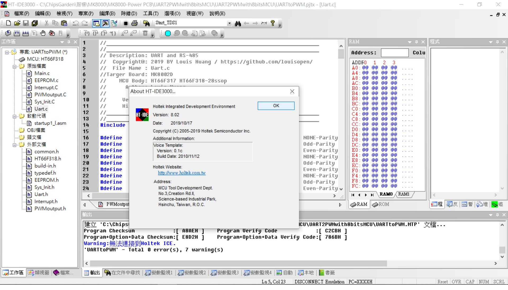
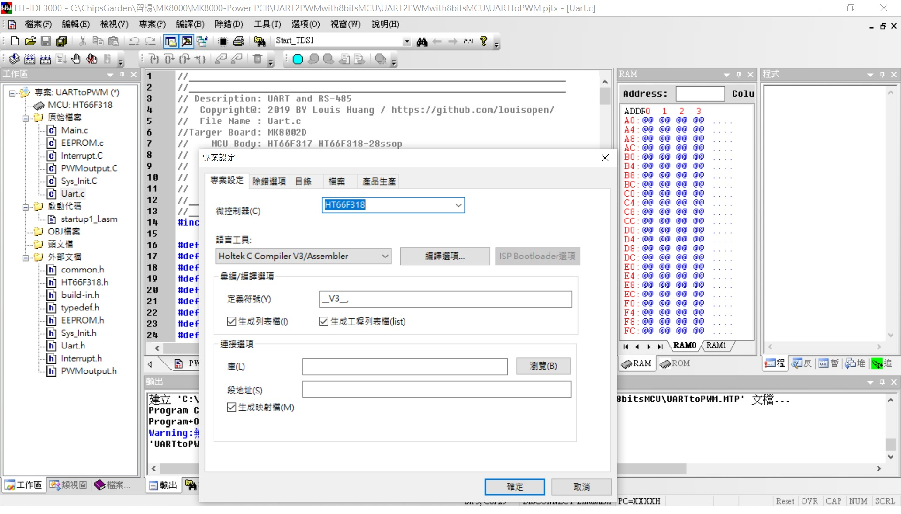
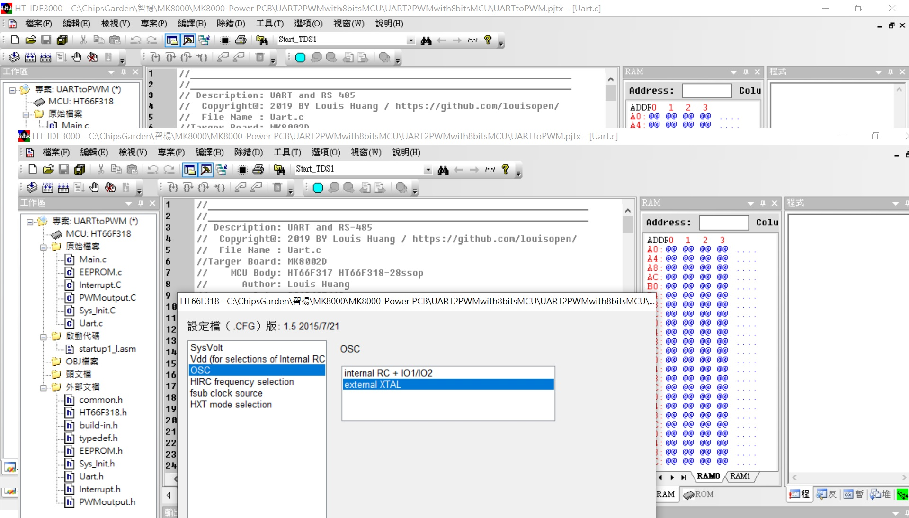
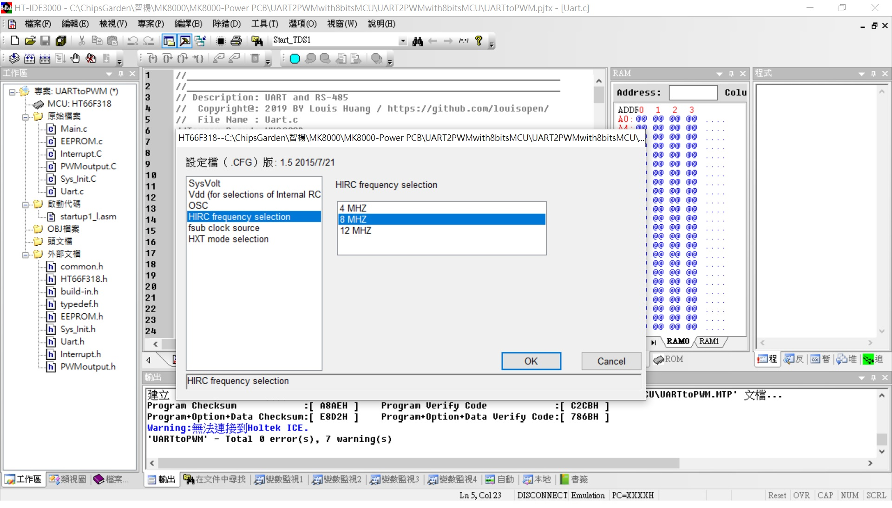

## ※UART with HT66F318 applications
* Using the UART port(Same RS-485 port) access GPIO port, EEPROM(64bytes), ADC(8ch 12bits), PWM output(10bit), Capture, OLED display... via HT66F318 UART port. 
專案利用PC or Raspberry Pi or Arduino 軟件主控下達UART通訊指令(Same RS-485 port) 
以存取HT66F318 GPIO port, EEPROM(64bytes), ADC(8ch 12bits), PWM output(10bit), Capture, OLED display... 
* 在MCU資源不足或是應用裝置缺乏時, 即可以自己製造簡單的應用裝置, Host即可透過UART來控制這個裝置. 

* Project Option: 
HXT (External 8MHz X'tal); 可選項有:HXT(400K~16Mhz),HIRC8M,HIRC12M,HIRC16M 
LICR (Low speed internal RC for TB0/TB1); 可選項有:LXT(32.768Khz),LIRC(32Khz) 

* UART port baudrate setting 9600,N,8,1 ;Protocol format refer RS-485 Modbus & CRC-16  
通訊協議格式參照RS-485通訊協議格式(Modbus & CRC-16). 

* TB0,1 enable LIRC interrupt for 0.514sec, 0.514sec 

* TM0 enable HXT interrupt for 200us 

* HT-IDE3000 HT66F317/HT66F318 28ssop with HT-IDE3000 & e-Link & e-WriterPro 
文件[HT66F318 Document](https://www.holtek.com.tw/search?key=ht66F318) 
模擬&除錯Development & Debug[IDE3000 & ICE](https://www.holtek.com.tw/web/guest/ice) 
燒入器Progrmming & writer[HOPE3000 & e-WriterPro](https://www.holtek.com.tw/web/guest/programmer) 

### Relevant information
* HT-IDE3000 V8.02

* HOLTEK C Compiler V3/Assembly

* HT66F318 Config, used 8Mhz X'tal external, VDD/VDDA binding

* HT66F318 28ssop Schematic Diagram

### How to test or used
利用PC通訊軟件做為主動工具, 協議(9600,n,8,1), 格式比照RS-485格式(PC指令CRC用 A0 0A代替, MCU反饋的為CRC-16)

* For Example: 
* UART Formate(Get from MCU): 44 02 00 00 00 00 A0 0A   #Reture test
MCU return: 44 02 04 55 AA 55 AA CRC CRC
