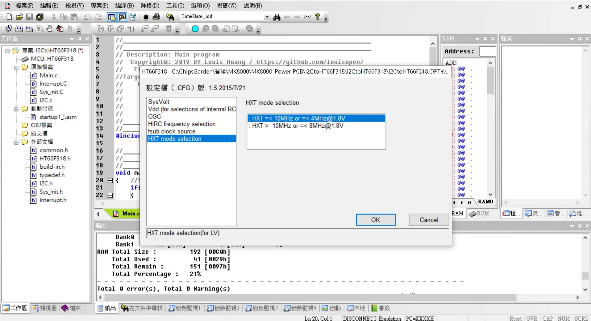

### UART with HT66F318 applications

Using the UART port(Same RS-485 driver) access to HT66F318 GPIO port, EEPROM(64bytes), ADC(8ch 12bits), 
PWM output(10bit), Capture, OLED display...
專案利用PC or Raspberry Pi or Arduino 軟件主控下達UART通訊指令(Same RS-485 driver)
以存取HT66F318 GPIO port, EEPROM(64bytes), ADC(8ch 12bits), PWM output(10bit), Capture, OLED display...

UART port baudrate setting 9600,N,8,1 ;Protocol format link as RS-485 Modbus & CRC-16 
通訊協議格式參照RS-485通訊協議格式(Modbus & CRC-16).

在MCU資源不足或是應用裝置缺乏時, 即可以製造自己的應用裝置, Host即可透過UART來控制這個裝置.

#### relevant information:

Tools: HT66F318 28ssop with HT-IDE3000 V8.02 & e-Link

Project Option: HXT (hi speed HXT);可選項HXT,HIRC8M,HIRC12M,HIRC16M,LXT,LIRC

* HT-IDE3000 V8.02

* HOLTEK C Compiler V3/Assembly

* HT66F318 Config, used 8Mhz X'tal external, VDD/VDDA binding

* HT66F318 28ssop Diagram

#### How to test or used:

利用PC通訊軟件做為主動工具, 協議(9600,n,8,1), 格式比照RS-485格式(PC指令CRC用 A0 0A代替, MCU反饋的為CRC-16)
* For Example: 
* UART Formate(Get from MCU): 44 02 00 00 00 00 A0 0A   #Reture test
MCU return: 44 02 04 55 AA 55 AA CRC CRC
