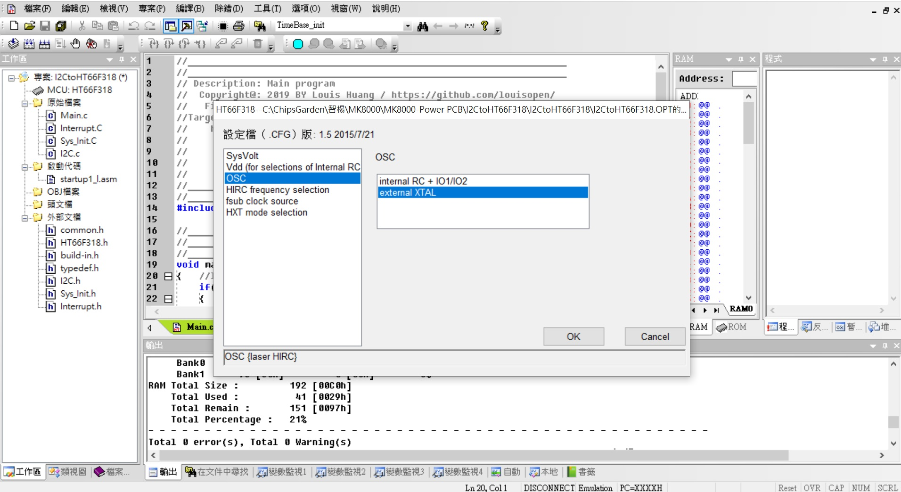

### UART with8bitsMCU
HT-IDE3000 V8.02  HT66F318 28ssop

Project Option可選擇:HXT,HIRC8M,HIRC12M,HIRC16M,LXT,LIRC 

Useing HT66F318 UART access to GPIO, LED matrix, EEPROM, ADC, I2C...(Same RS-485 driver)
此專案利用PC軟件下達指令以存取MCU內部的EEPROM(64bytes), ADC(8ch 10bits), PWM output(10bit), Capture... 
後續還可以持續增加I2C(Hi resolution adc), SPI(OLED display) 都透過UART 9600,N,8,1 協議格式參照RS-485通訊協議格式.

* HT-IDE3000 V8.02

* HOLTEK C Compiler V3/Assembly

* HT66F318 Config, used 8Mhz X'tal external, VDD/VDDA binding

* HT66F318 28ssop Diagram

#### How to test or used:
利用PC通訊軟件做為主動工具, 協議(9600,n,8,1), 格式比照RS-485格式(PC指令CRC用 A0 0A代替, MCU反饋的為CRC-16)

* For Example: 
* UART Formate(Get from MCU): 44 02 00 00 00 00 A0 0A   #Reture test
MCU return: 44 02 04 55 AA 55 AA CRC CRC

#### Other applications:
* UART access to ADC converter(HY3118 24bit ADC) via I2C bus.
* UART access to OLED 16x2 display driver via SPI bus.

